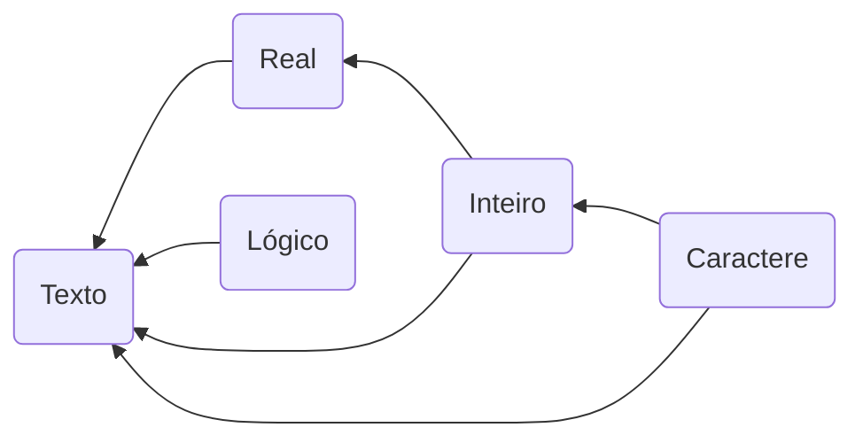

# Tipos Básicos

Os tipos básicos são `Inteiro`, `Real`, `Texto`, `Lógico` e `Caractere`.

```note
Note que os tipos começam com letras maiúsculas.
```

| Tipo | Valores |
| --- | --- |
| Inteiro | `-4`, `0`, `5`, ... |
| Real | `-7.23`, `0.0`, `5.25`, ... |
| Texto | `"texto"`, `"ola"`, `"mundo"`, ... |
| Lógico | `verdadeiro` e `falso` |
| Caractere | `'a'`, `'4'`, `'&'`, ... |


Exemplo

```portugol
a: Inteiro = 10
r: Real = 3.14
s: Texto = "Programação"
b: Lógico = verdadeiro
c: Caractere = 'z'
```

## Conversão Automática de Tipos



## Operações Aritméticas

Soma (`+`)

```python
5 + 3         # 8
1.5 + 2.3     # 3.8
1 + 2.3       # 3.3
1.5 + 2       # 3.5
'a' + 1       # 98 (97 + 1)
'a' + 'b'     # 195 (97 + 98)
```

Subtração (`-`)
```portugol
5 - 3         # 2
5.5 - 3.2     # 2.3
5.5 - 3       # 2.5
5 - 3.2       # 1.8
'b' - 1       # 97
'b' - 1.5     # 96.5
'b' - 'a'     # 1
```

Multiplicação (`*`)
```python
5 * 3         # 15
5.0 * 3.5     # 17.5
5 * 3.0       # 15.0
'a' * 2       # 194
'a' * 'b'     # 9506 (97 * 98)
```

Divisão Real (`/`)
```python
5 / 3         # 1.66667
5.0 / 3       # 1.66667
5.0 / 3.0     # 1.66667
'a' / 2       # 48.5
```

Divisão Inteira (`div`)
```portugol
5 div 3       # 1
'a' div 3     # 32 
```

Resto da divisão (`mod`)
```portugol
5 mod 3       # 2, o resto da divisão de 5 por 3
'a' mod 3     # 1 (97 mod 1)
10.5 mod 3    # 1.5
-5 mod 3      # -2
0 mod 3       # 0
```

Exponenciação (`^`)
```portugol
5 ^ 2       # 25.0
```

## Operações com Texto

Concatenação (`+`)
```portugol
"ab" + "cd"          # "abcd"
"ab" + 12            # "ab12"
"ab" + 'c'           # "abc"
"ab" + 1.2           # "ab1.2"
"ab" + verdadeiro    # "abverdadeiro"
```

Interpolação
```portugol
"ab {12} {'c'} {1.2} {verdadeiro}"   # "ab 12 c 1.2 verdadeiro"
```

Diferença
```portugol
"abc" - "cde"        # "ab"
```

Duplicação
```portugol
"abc" * 3           # "abcabcabc"
```

## Operações Lógicas

Valores lógicos (booleanos): `verdadeiro` e `falso`

### `e` lógico
```portugol
falso e falso            # falso
falso e verdadeiro       # falso
verdadeiro e falso       # falso
verdadeiro e verdadeiro  # verdadeiro
```

Exemplo
```portugol
nota = 8
nota_válida = (nota >= 0) e (nota <= 10)
```

### `ou` lógico
```portugol
falso ou falso            # falso
falso ou verdadeiro       # verdadeiro
verdadeiro ou falso       # verdadeiro
verdadeiro ou verdadeiro  # verdadeiro
```

Exemplo
```portugol
nota = 8
nota_inválida = (nota < 0) ou (nota > 10)
```

### `não` lógico
```portugol
não falso            # verdadeiro
não verdadeiro       # falso
```

### Tabela Verdade

| A | B | A `e` B | A `ou` B | `não` A | `não` B |
| --- | --- | --- | --- | --- | --- | 
| falso | falso | falso | falso | verdadeiro | verdadeiro |
| falso | verdadeiro | falso | verdadeiro | verdadeiro | falso |
| verdeiro | falso | falso | verdadeiro | falso | verdadeiro |
| verdadeiro | verdadeiro | verdadeiro | verdadeiro | falso | falso |


## Operações de comparação (relacionais)

### Igualdade (`==`)
```portugol
2 == 2         # verdadeiro
"a" == "a"     # verdadeiro
"a" == 'a'     # falso
```

### Desigualdade (`<>`)
```portugol
2 <> 3         # verdadeiro
2 <> 2         # falso
"ab" <> "ba"   # verdadeiro
```

### Menor (`<`)
```python
2 < 3                # verdadeiro
2 < 2                # falso
3 < 2                # falso
"ab" < "cd"          # verdadeiro
falso < verdadeiro   # verdadeiro
```

### Menor ou igual (`<=`)
```python
2 <= 3         # verdadeiro
2 <= 2         # verdadeiro
3 <= 2         # falso
"ab" <= "cd"   # verdadeiro
```

### Maior (`>`)
```python
2 > 3                # falso
2 > 2                # falso
3 > 2                # verdadeiro
"ab" > "cd"          # falso
falso > verdadeiro   # falso
```

### Maior ou igual (`>=`)
```python
2 >= 3         # falso
2 >= 2         # verdadeiro
3 >= 2         # verdadeiro
"ab" >= "cd"   # falso
```
